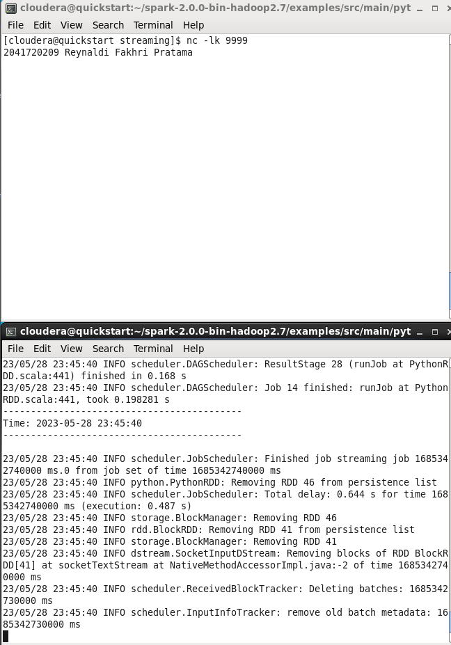

# Big-Data
Tugas - Reynaldi Fakhri Pratama - 2041720209
Spark Streaming

## 1. Stateless

## 2. Stateful

## 3. Transformasi di spark streaming

### TUGAS PRAKTIKUM

### Kode 1 

- sys.argv : argumen saat program dijalankan. Argumen ini didapatkan dari input user.
- sys.stderr : objek yang digunakan untuk menampilkan pesan kesalahan / berkaitan dengan keluaran standar kesalahan.
- StreamingContext : kelas inti dalam modul PySpark Streaming yang digunakan untuk membuat dan mengonfigurasi aplikasi streaming.
- sc : instansiasi dari objek SparkContext
- socketTextStream : membuat DStream (Distributed Stream) dari sumber data streaming melalui koneksi socket.
- reduceByKey : melakukan operasi reduksi pada pasangan kunci-nilai (key-value pairs) dalam RDD.
- lambda line : sebagai fungsi mapping sederhana hanya dalam satu baris.
- awaitTermination : memungkinkan aplikasi streaming tetap berjalan dan memblokir eksekusi hingga secara manual dihentikan atau terjadi kegagalan

### Kode 2 

- nc : perintah untuk menjalankan netcat yang berguna untuk membuat, mengirim, dan menerima koneksi jaringan TCP atau UDP
- lk : opsi dari perintah netcat, dimana (l) berarti listen dan (k) yaitu keep open, yang artinya netcat akan tetap berjalan (melakukan listening) dan terus terbuka.

### Kode 3 

- spark-submit : perintah yang digunakan untuk mengirimkan dan menjalankan aplikasi PySpark (aplikasi yang ditulis dalam Python dengan menggunakan Apache Spark) di dalam cluster Apache Spark.
- master : menentukan url master dari spark.
- local[*] : menginstruksikan Spark untuk menjalankan aplikasi PySpark secara lokal pada mesin yang sama. simbol * menunjukkan kepada Spark untuk menggunakan sebanyak mungkin inti CPU yang tersedia pada mesin tersebut.

### Kode 4 :
- ssc.checkpoint : mengatur direktori tempat data metadata ssc (StreamingContext) disimpan.
parallelize : untuk membuat RDD dari koleksi yang ada di dalam Python.
- updateStateByKey : mengimplementasikan transformasi stateful pada DStream (Distributed Stream) yang sedang berjalan.
- flatMap : memproses koleksi data dengan mengaplikasikan sebuah fungsi pada setiap elemen koleksi dan mengembalikan nol atau lebih elemen dalam bentuk yang datar.

### Kode 5 : 
- rdd.take(5) : mengambil jumlah elemen ke-5 dari RDD.
- transform : mengubah RDD menjadi RDD baru dengan melakukan operasi pada elemen-elemen RDD yang ada sesuai dengan filter transformasi.
- rdd.sortByKey(False) : untuk mengurutkan elemen-elemen RDD berdasarkan kunci dalam urutan menurun (descending order).
